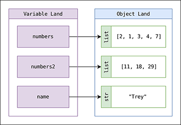

## The Auckland Challenge

**Questions we cannot answer with GIS software alone:**

- Where should we put 1,000 new e-scooter parking zones?
- Which SA2 areas have the worst accessibility to green spaces?
- How do pedestrian flows change hour by hour?
- What if we implemented congestion charging?

. . .

**Answer**: <span style="color:red;">We need to write code.</span>

---

## From Questions to Code

**Traditional GIS** (QGIS, ArcGIS):

- Click → Select → Buffer → Join → Export
- Great for one-off analysis, but hard to reproduce
- Cannot handle millions of trips automatically

**Programming** (Python):

```python
for zone in auckland_sa2:
    accessibility = calculate_15min_amenities(zone)
    if accessibility < threshold:
        flag_for_intervention(zone)
```

**Result**: Reproducible, scalable, shareable

---

## Why Python for GIS?

**1. Open source and free**: No licence fees, works on any platform

**2. Massive ecosystem**:

```
┌─────────────────────────────┐
│  Your Geospatial Code       │
├─────────────────────────────┤
│  geopandas | osmnx | r5py   │ ← Spatial libraries
├─────────────────────────────┤
│  pandas | numpy | matplotlib│ ← Data science
├─────────────────────────────┤
│  Python 3.10+               │ ← Language
└─────────────────────────────┘
```

**3. Reproducibility**: Anyone can run the same code and get the same results


## How will we cover it?

* **<span style="color:blue">Install Python on your machine (Default)</span>**
* Google Colab (only for today)
* Jupyter lab / PyCharm / VS Code (Optional)


&nbsp;

Make sure you are well set up with Google Colab using the URL below:
<center><span style="color:blue;">https://colab.research.google.com</span></center>


## What will we cover today?

* Variables and data types
* Lists
* `for` loops
* Conditional statements

&nbsp;

**Helpdesk**: Wednesday 12pm-2pm Lab Sessions | Ed Discussion

**Web book**: [https://dataandcrowd.github.io/python-gis/](https://dataandcrowd.github.io/python-gis/) for self-paced practice


# Part 1: Variables and Data Types

## For the first time

```python
print("Hello World")
```

* Commenting on a Python Notebook or Google Colab

```python
# This is a single-line comment

'''
This is a multi-line comment
Line 1
Line 2
'''
```

---

## Variables: Storing Information

* A <span style="color:blue;">**variable**</span> is a location in memory that stores a value.

{fig-align="center"}

```python
weather = "Freezing"
print(weather)
```

---

### Variables with Auckland data

```python
# Store a number
population = 1_700_000

# Store text (a string)
city = "Auckland"

# Store a calculation
density = population / 1180  # Population per km²

# Display results using f-strings
print(f"{city} has {population:,} people")
print(f"Density: {density:.1f} people per km²")
```

```
Auckland has 1,700,000 people
Density: 1440.7 people per km²
```

---

### Variable as pointer

```python
x = [1, 2, 3]
y = x
```
* You have created two variables `x` and `y` which both point to the same object.

```python
x = 'something else'
print(y)  # y is unchanged
```
* The `=` operator changes what the name points to, not the object itself.


## Built-In Types {.smaller}

| Data type | Description          | Example    |
|-----------|----------------------|------------|
| `int`     | Whole integer values | `4`        |
| `float`   | Decimal values       | `3.1415`   |
| `str`     | Character strings    | `'Freezing'` |
| `bool`    | True/false values    | `True`     |

&nbsp;

```python
x = 4         # int
x = 3.14159   # float
x = 'hello'   # str
x = True      # bool

type(x)       # Check what type a variable is
```

---

### Strings

```python
weatherForecast = "Freezing"
type(weatherForecast)

# Concatenation
print(weatherForecast + weatherForecast)
print(5 * weatherForecast)

# Case transformations
print(weatherForecast.upper())
print(weatherForecast.lower())
```

---

### Operators {.smaller}

- **Addition** `a + b` | **Subtraction** `a - b` | **Multiplication** `a * b`
- **True division** `a / b` | **Floor division** `a // b`
- **Modulus** `a % b` | **Exponentiation** `a ** b`

```python
print(11 / 2)   # 5.5
print(11 // 2)  # 5
```

---

### Comparison and Boolean Operations

```python
# Comparisons: ==  !=  <  >  <=  >=
25 % 2 == 1    # Is 25 odd? True

# Boolean operators: and, or, not
x = 4
(x < 6) and (x > 2)    # True
(x > 10) or (x % 2 == 0)  # True
not (x < 6)             # False
```


## <span style="color:green;">Practice 1: Fill in the blanks</span>

::: {style="font-size: 120%;"}

```python
# 1. Store information about two Auckland landmarks
sky_tower_lat = ____
sky_tower_lon = 174.7633
gallery_lat = -36.8567
gallery_lon = ____

# 2. What data types are these?
name = "Sky Tower"
height = 328
is_tallest_in_nz = ____

print(type(name))       # ____
print(type(height))     # ____
print(type(is_tallest_in_nz))  # ____

# 3. Calculate the difference in latitude and longitude
diff_lat = gallery_lat ____ sky_tower_lat
diff_lon = gallery_lon - sky_tower_lon
print(f"Latitude difference: {diff_lat:.4f}")
print(f"Longitude difference: {____:.4f}")
```

:::

::: {.fragment}
*Hint*: Sky Tower lat = -36.8485, Art Gallery lon = 174.7722. The Sky Tower **is** the tallest structure in NZ.
:::


# Part 2: Lists

## Lists

* When we have multiple items, we store them in a **list** (like drawers in a cabinet).

{fig-align="center"}

---

### List basics

::: {style="font-size: 140%;"}

```python
suburbs = ["Newmarket", "Ponsonby", "Parnell", "Grey Lynn"]

# Access by index (starts at 0!)
print(suburbs[0])   # "Newmarket"
print(suburbs[-1])  # "Grey Lynn"

# Add to list
suburbs.append("Mt Eden")
print(len(suburbs)) # 5
```

:::

---

### List example: Auckland Western Line

```{python}
#| echo: true

western_line = [
    "Britomart", "Parnell", "Newmarket", "Grafton",
    "Mt Eden", "Kingsland", "Morningside", "Baldwin Ave"
]

western_line
```

---

### Indexing and slicing

```{python}
#| echo: true

western_line[1]       # 'Parnell' (not 'Britomart'!)
western_line[2:5]     # slice from index 2 to 4
western_line[-1]      # last element
```

. . .

**Modifying:**

```{python}
#| echo: true
western_line[3] = 'Auckland City'
western_line.append("new station")
print(western_line)
```

---

### Built-in data structures (overview) {.smaller}

| Type | Example | Description |
|------|---------|-------------|
| `list` | `[1, 2, 3]` | Ordered, mutable collection |
| `tuple` | `(1, 2, 3)` | Ordered, immutable collection |
| `dict` | `{'a':1, 'b':2}` | Key-value mapping |

We will cover `tuple` and `dict` in the lab.


## <span style="color:green;">Practice 2: Fill in the blanks</span> {.smaller}

```python
western_line = ["Britomart", "Parnell", "Newmarket", "Grafton",
    "Mt Eden", "Kingsland", "Morningside", "Baldwin Ave"]

# 1. Create a list of additional stations
more_western = [____, ____, ____, ____, ____]

# 2. Combine the two lists using extend
western_line.______(more_western)

# 3. Print the total number of stations
print(f"Total stations: {____(western_line)}")
```

*Hint*: The extra stations are Mt Albert, Avondale, New Lynn, Fruitvale Rd, Glen Eden. Use `extend` and `len`.


# Part 3: `for` Loops

## `for` loop

* Loops allow parts of code to be repeated some number of times.

::: {style="font-size: 150%;"}

```python
for variable in collection:
    do things with variable
```

:::

::: {style="font-size: 70%;"}

* The statement must end with a colon `:`
* The body must be indented by **4 spaces**
* No special keyword needed to end the loop

:::

---

### for loop examples

::: {style="font-size: 140%;"}

```python
for name in western_line:
    print(name)
```

:::

&nbsp;

Using `range`:

::: {style="font-size: 140%;"}

```{python}
#| echo: true

for value in range(5):
    print(value)
```

:::

---

### Looping over two lists

::: {style="font-size: 105%;"}

```python
cities = ["Helsinki", "Stockholm", "Oslo", "Reykjavik", "Copenhagen"]
countries = ["Finland", "Sweden", "Norway", "Iceland", "Denmark"]
```

:::

```python
for i in range(len(cities)):
    print(cities[i], "is the capital of", countries[i])
```

```
Helsinki is the capital of Finland
Stockholm is the capital of Sweden
Oslo is the capital of Norway
Reykjavik is the capital of Iceland
Copenhagen is the capital of Denmark
```


## <span style="color:green;">Practice 3: Fill in the blanks</span>

```python
sa2_names = ["Ponsonby", "Grey Lynn", "Mt Eden", "Epsom"]
populations = [8200, 11500, 9300, 7100]

# Print each SA2 area and its population
for i in range(____):
    print(f"{____} has a population of {____}")
```

::: {.fragment}
*Hint*: How many items are in `sa2_names`? Use `len()`. Then index into both lists with `i`.
:::


# Part 4: Conditional Statements

## Conditional statements

* **IF** a condition is met, **THEN** a set of actions is performed.

::: {style="font-size: 160%;"}

```python
temperature = 17

if temperature > 25:
    print("it is hot!")
else:
    print("it is not hot!")
```

:::

---

### if, elif and else

::: {style="font-size: 120%;"}

```python
temperature = -3

if temperature > 0:
    print(temperature, "degrees celsius is above freezing")
elif temperature == 0:
    print(temperature, "degrees celsius is at the freezing point")
else:
    print(temperature, "degrees celsius is below freezing")
```

```
-3 degrees celsius is below freezing
```

:::

---

### Combining conditions

| Keyword | Example | Description                   |
|---------|---------|-------------------------------|
| `and`   | `a and b` | True if both a and b are True |
| `or`    | `a or b`  | True if either a or b is True |

::: {style="font-size: 120%;"}

```python
weather = "rain"
wind_speed = 14
comfort_limit = 10

if (weather == "rain") or (wind_speed >= comfort_limit):
    print("Just stay at home")
else:
    print("Go out and enjoy the weather! :)")
```

:::

---

### Combining for-loops and conditionals

```python
temperatures = [0, 12, 17, 28, 30]

for temperature in temperatures:
    if temperature > 25:
        print(temperature, "is hot")
    else:
        print(temperature, "is not hot")
```

```
0 is not hot
12 is not hot
17 is not hot
28 is hot
30 is hot
```


## <span style="color:green;">Practice 4: Fill in the blanks</span>

```python
sa2_names = ["Ponsonby", "Grey Lynn", "Mt Eden", "Epsom"]
populations = [8200, 11500, 9300, 7100]

for i in range(len(sa2_names)):
    if populations[i] ____ 9000:
        print(f"{sa2_names[i]} is a _____ area")
    else:
        print(f"{sa2_names[i]} is a _____ area")
```

::: {.fragment}
*Hint*: Use `>` for the comparison. Fill in "larger" and "smaller" (or similar labels of your choice).
:::


# What You Will Build

## Your journey this semester

```
Week 1-2: Hello World + Python Fundamentals (you are here!)
  ↓
Week 4: Your First Map (Assignment 1)
  ↓
Week 8: Interactive Web Dashboard (Assignment 2)
  ↓
Week 12: Published Python Package (Assignment 3)
```

. . .

**Week 12 goal:**

```bash
pip install your-urban-toolkit
```

```python
from your_package import calculate_walkability
score = calculate_walkability(streets, amenities)
```


## Documentation
* *Hang on, do I have to memorise everything?*
* The answer is **NO**
* LLMs (Yes, but please go back and examine retrospectively)
* **Web book**: [https://dataandcrowd.github.io/python-gis/](https://pythongis.org/)
* Visit https://www.python.org/doc
* Google your problem


## Summary

::: {style="font-size: 85%;"}

::: {.incremental}
* We code because GIS software alone cannot automate, reproduce, and scale our analyses
* Python is open source, has a massive ecosystem, and ensures reproducibility
* Today we covered:
   - Variables and data types (`int`, `float`, `str`, `bool`)
   - Lists (indexing, slicing, appending)
   - `for` loops (iterating over collections)
   - Conditional statements (`if`, `elif`, `else`)

:::
:::

## Next week
* Recap of today's work + working on conditions
* How to import spreadsheet data on Colab: dataframe
* How to clean and use dataframes


## References

* Tekanen et al. (2022), Introduction to Python for Geographic Data Analysis, https://pythongis.org/
* Rey et al. (2020), Geographic Data Science with Python, https://geographicdata.science/book 
* Dorman et al (2023), Geocomputation with Python, https://py.geocompx.org/


## Thanks! <br> Q & A{style="text-align: center;"}


<div style="width:840px"><iframe allow="fullscreen" frameBorder="0" height="480" src="https://giphy.com/embed/PwSkiR02N3960AC5c1/video" width="840"></iframe></div>
