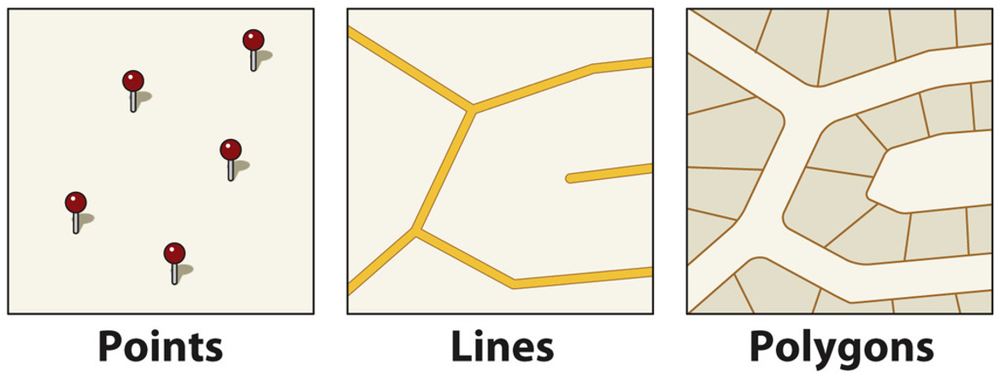
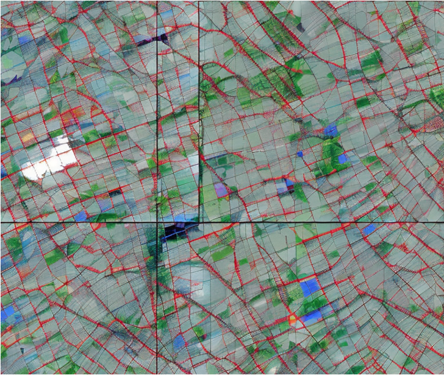
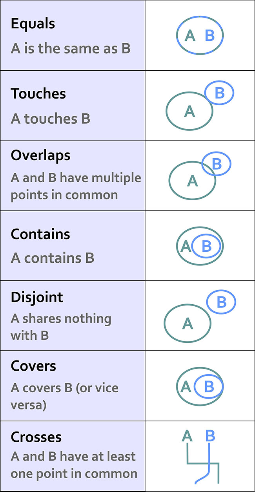
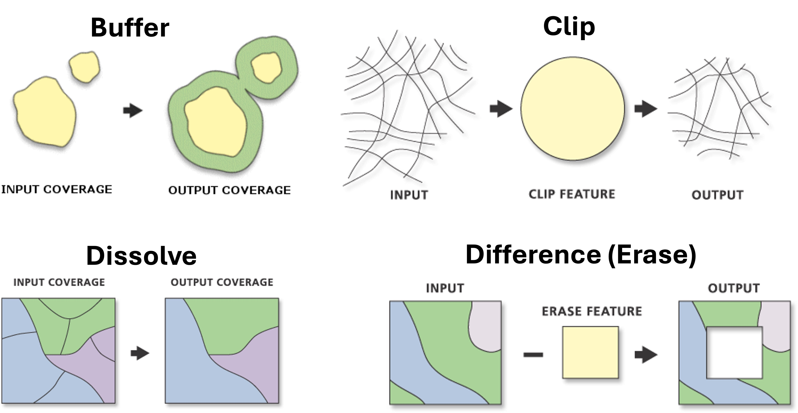

## Today's Lecture

- What is GIS?
- Types of maps
- Vector and raster data
- File formats and CRS
- Working with `geopandas`
- Spatial relationships and joins
- Vector tools (buffer, clip, dissolve, erase, intersect)
- Raster basics with `rasterio`
- Practical exercise: NZ regional data


## What is GIS?

* **Geographic Information Systems**
* *A computer system for capturing, storing, checking, and displaying data related to positions on Earth's surface*
* Roger Tomlinson coined the term GIS

<br>

* All data in GIS are **georeferenced**, meaning each feature has:
    - **Attribute**: what it is (name, type, value)
    - **Spatial information**: where it is (coordinates, location)


## GIS Example Questions

Here are just some of the questions that GIS allows us to explore with <span style="color:blue">**crime data**</span>:

<br>

* Where are the most vulnerable communities located?
* Why do crimes occur in one area and not another?
* How do offenders travel to the crime location?
* Where are there more or less stop and search than we would expect?


## Reference vs Thematic Maps

* <span style="color:blue">**Reference Maps**</span>: communicate location on static data points
    * To "pin point" data on a map
    * Descriptive

<br>

* <span style="color:#E49B0F">**Thematic Maps**</span>: highlight a spatial relationship
    * To "study a theme" within a map
    * Explanatory


## Rail Maps

* **Reference** maps because they show the location of stations and each line
* **Thematic** maps because they can predict life expectancy, poverty and median house prices

<br>

### Other cases

* The visualisation of road networks to improve road safety measures is a...
* The visualisation of the earth's surface showing elevation is a...
* Navigation tools such as Google Maps can be classed as...

::: {.notes}
Road networks for safety = thematic map. Elevation = topographic map. Google Maps = reference/navigational map.
:::


## Geospatial Data Types

:::: {.columns}

::: {.column width="50%"}

* **Vector**: points, lines and polygons



:::

::: {.column width="50%"}

* **Raster**: imagery or satellite data formed from a grid of pixels

{width="50%" fig-align=center}

:::

::::


## File Formats {.smaller}

* **Shapefile** (.shp): traditional GIS format requiring multiple companion files (.shx, .dbf, .prj)
* **GeoTIFF** (.tif): standard raster format with embedded CRS
* **GeoJSON** (.geojson): web-friendly, human-readable, based on JSON
* **GeoPackage** (.gpkg): modern SQLite-based format for vector and raster
* **KML/KMZ**: used primarily in Google Earth
* **CSV + coordinates**: plain text georeferenced via lat/lon columns
* **GPX**: GPS Exchange Format for routes, tracks, waypoints
* **NetCDF / HDF5**: multi-dimensional arrays for climate and earth observation


## Python Tools for Geospatial Data

### Vector Data

| Package      | Level     | Description                                                                 |
|--------------|-----------|-----------------------------------------------------------------------------|
| `shapely`    | Low-level | Handles individual geometry objects (points, lines, polygons)               |
| `geopandas`  | High-level| Works with GeoSeries and GeoDataFrames; built on shapely                    |

---

### Raster Data

| Package       | Focus      | Description                                                                 |
|---------------|------------|-----------------------------------------------------------------------------|
| `rasterio`    | Simple rasters | Uses `numpy` arrays + metadata dictionary (CRS, transform, etc.)       |
| `xarray`      | Complex rasters | Uses `xarray.Dataset` and `DataArray`; ideal for NetCDF and multi-band |


## Projection Methods

* Moving from the 3D to the 2D

:::: {.columns}

::: {.column width="30%"}
* Cylindrical
* Conical
* Planar
:::

::: {.column width="70%"}
{width=80%}
:::

::::


## Distortion

The misrepresentation of:

* Area
* Shape
* Distance
* Direction of points

<br>

Every projection preserves some properties at the expense of others.


## Coordinate Reference Systems (CRS) {.smaller}

* **EPSG:4326 (WGS 84)**: latitude and longitude in degrees; default for GPS; unsuitable for distance/area calculations
* **EPSG:3857 (Web Mercator)**: used by Google Maps and OpenStreetMap; units in metres but distorts areas at high latitudes
* **EPSG:2193 (NZTM)**: New Zealand Transverse Mercator; metres; best choice for NZ analyses

<br>

::: {.callout-important}
Always check and match CRS when combining datasets. Mixing CRS will produce incorrect results!
:::


## Getting Started with `geopandas` {.smaller}

```python
import geopandas as gpd
countries = gpd.read_file("world.gpkg")
countries.head()
```

```
iso_a3  name              continent    pop_est   gdp_md_est  geometry
AFG     Afghanistan       Asia         34124811  64080       POLYGON ((61.21082 ...
AGO     Angola            Africa       29310273  189000      MULTIPOLYGON (((23.9...
ALB     Albania           Europe       3047987   33900       POLYGON ((21.02004 ...
```

```python
type(countries)
```

```
geopandas.geodataframe.GeoDataFrame
```


## What is a GeoDataFrame?

* Just like a DataFrame but with a special `geometry` column

```python
countries["geometry"].head(n=3)
```

* Access individual geometries:

```python
countries['geometry'].iloc[0]
```

* Quick mapping:

```python
countries.plot()       # static map
countries.explore()    # interactive map
```


## Leveraging pandas Operations {.smaller}

```python
# Total world population
countries["pop"].sum() / 1e9  # In billions
```

```python
# Population by continent
grouped = countries.groupby("continent")
pop_by_continent = grouped["pop"].sum()
```

```python
# Boolean filtering
is_NZ = countries["name"] == "New Zealand"
NZ = countries.loc[is_NZ]
```

```python
# Squeeze a single-row DataFrame to a Series
NZsqueezed = NZ.squeeze()
NZsqueezed.geometry
```


## Creating Point Data from a Dictionary {.smaller}

```python
data = {
    "Name": ["New York City", "São Paulo", "Tokyo", "Lagos", "Sydney"],
    "Population": [8419600, 12325232, 13929286, 15000000, 5312163],
    "Latitude": [40.7128, -23.5505, 35.6895, 6.5244, -33.8688],
    "Longitude": [-74.0060, -46.6333, 139.6917, 3.3792, 151.2093]
}

cities_df = pd.DataFrame(data)

gdf = gpd.GeoDataFrame(
    cities_df,
    geometry=gpd.points_from_xy(
        cities_df['Longitude'],
        cities_df['Latitude']
    ),
    crs='EPSG:4326'
)
```


## Converting CRS

* Use `to_crs()` to reproject

```python
# Check current CRS
print(countries.crs)

# Reproject to Mercator
no_antarctica = countries.loc[countries["name_long"] != "Antarctica"]
countries_mercator = no_antarctica.to_crs(epsg=3395)
```

* For distance and area calculations: use a projected CRS in metres (e.g. EPSG:2193 for NZ)
* For web mapping: use EPSG:3857
* For spatial operations: ensure all datasets share the same CRS


## Spatial Relationships {.smaller}

:::: {.columns}

::: {.column width="40%"}
* `equals`
* `contains`
* `crosses`
* `disjoint`
* `intersects`
* `overlaps`
* `touches`
* `within`
* `covers`
:::

::: {.column width="20%"}

:::

::: {.column width="40%"}
{width=70%}
:::

::::


## Example: Which Country Contains New York? {.smaller}

```python
cities_url = "https://raw.githubusercontent.com/dataandcrowd/GISCI343/main/docs/Lecture03/data/ne_110m_populated_places.gpkg"
cities = gpd.read_file(cities_url)

new_york = cities.loc[cities["name"] == "New York"].geometry.squeeze()
type(new_york)   # shapely.geometry.point.Point

countries.contains(new_york)

countries.loc[countries.contains(new_york)]
```

```python
USA = countries.loc[countries.contains(new_york)].squeeze().geometry
new_york.within(USA)  # Returns: True
```


## Your Turn

* Use the same code to find **Auckland**


## Spatial Join `sjoin` {.smaller}

* Merging attributes from two GeoDataFrames based on their spatial relationship

```python
joined = gpd.sjoin(
    cities,
    countries,
    predicate="within",
    how="left",
    lsuffix="city",
    rsuffix="country",
)

joined.head()
```

```
    name_city        geometry                  index_country iso_a3 name_country continent  pop_est  gdp_md_est
0   Vatican City     POINT (12.45339 41.90328) 79.0          ITA    Italy        Europe     62137802 2221000
1   San Marino       POINT (12.44177 43.93610) 79.0          ITA    Italy        Europe     62137802 2221000
2   Vaduz            POINT (9.51667 47.13372)  9.0           AUT    Austria      Europe     8754413  416600
```

---

### Filtering and Plotting Joined Data

```python
cities_in_italy = joined.loc[joined["name_long"] == "Italy"]

italy = countries.loc[countries["name"] == "Italy"]

fig, ax = plt.subplots(figsize=(8, 8))
italy.plot(ax=ax, facecolor="none", edgecolor="black")
ax.set_axis_off()
ax.set_aspect("equal")
cities_in_italy.plot(ax=ax, color="red")
```


## Vector Tools {.smaller}



::: {.notes}
* `buffer`: zone around a feature at a defined distance; for proximity analysis
* `clip`: extract a specific area from one dataset using another as a boundary
* `dissolve`: merge features into one based on a common attribute
* `difference (erase)`: remove overlapping areas of one layer from another
* `intersect`: extract overlapping portions of two layers
* `merge`: combine two or more layers into one
* `spatial join`: match rows based on relative spatial locations
:::


## Vector Tools in Python {.smaller}

```python
import geopandas as gpd
from shapely.geometry import Polygon, Point, LineString

gdf.buffer(distance)                         # Buffer
gpd.clip(gdf, mask)                          # Clip
gpd.overlay(A, B, how='difference')          # Difference (Erase)
gdf.dissolve(by='region')                    # Dissolve
gpd.overlay(A, B, how='intersection')        # Intersect
pd.concat([gdf1, gdf2], ignore_index=True)   # Merge
```


## Buffer and Overlay Example {.smaller}

```python
# Reproject to metres
africa = countries.loc[countries["continent"] == "Africa"]
africa = africa.to_crs(epsg=3857)

cities_3857 = cities.to_crs(epsg=3857)
buffered_cities = cities_3857.copy()
buffered_cities["geometry"] = buffered_cities.buffer(250e3)
```

```python
fig, ax = plt.subplots(figsize=(8, 8))

# Difference: areas in Africa NOT within 250km of a city
diff = gpd.overlay(africa, buffered_cities, how="difference")
diff.plot(facecolor="#b9f2b1", ax=ax)
ax.set_axis_off()
ax.set_aspect("equal")
```

---

### Clip Example

```python
# Clip cities to only those within Africa
cities_in_africa = gpd.clip(cities_3857, africa)

fig, ax = plt.subplots(figsize=(8, 8))
africa.plot(ax=ax, facecolor="lightyellow", edgecolor="black")
cities_in_africa.plot(ax=ax, color="red", markersize=10)
ax.set_axis_off()
ax.set_aspect("equal")
```

---

### Intersect Example

```python
# Find the parts of Africa within 250km of a city
intersection = gpd.overlay(africa, buffered_cities, how="intersection")

fig, ax = plt.subplots(figsize=(8, 8))
africa.plot(ax=ax, facecolor="lightgrey", edgecolor="black")
intersection.plot(ax=ax, facecolor="coral", edgecolor="black", alpha=0.6)
ax.set_axis_off()
ax.set_aspect("equal")
```

---

### Dissolve Example

```python
# Dissolve NZ regions by island
dissolved = pop23.dissolve(by='Island').reset_index()
dissolved.plot(column='Island')
```


## Choropleth Maps {.smaller}

Classification schemes divide continuous data into discrete classes for mapping:

```python
import mapclassify as mc

fig, ax = plt.subplots(figsize=(8, 8))

pop23.plot(
    ax=ax,
    column="VAR_1_23",
    edgecolor="black",
    linewidth=0.5,
    legend=True,
    legend_kwds=dict(loc="lower right", fontsize=10),
    scheme="FisherJenks",
    cmap="viridis"
)

ax.set_title("Fisher Jenks: k = 5")
ax.set_axis_off()
ax.set_aspect("equal")
```

---

### Interactive Maps

```python
pop23.explore(
    column="VAR_1_23",
    cmap="viridis",
    tiles="CartoDB positron",
)
```


## Raster Data {.smaller}

So far we have been working mainly with vector data using `geopandas`: lines, points, polygons

The basemap tiles we have been using are an example of raster data

* Raster data:
  - Gridded or pixelated
  - Maps easily to an array

<br>

* **Continuous rasters**: satellite imagery, DEMs, canopy height from LiDAR
* **Categorical rasters**: land cover maps, snowcover masks


## Raster: Resolution, Extent, Multi-band

* **Resolution**: the spatial distance a single pixel covers on the ground
* **Extent**: the bounding box covering the entire raster footprint

<br>

* Colour images are **multi-band rasters**
* Each band measures light reflected from different parts of the electromagnetic spectrum


## The Raster Format: GeoTIFF

* A standard `.tif` image with additional spatial information embedded:
  * Geotransform (extent, resolution)
  * Coordinate Reference System (CRS)
  * NoData values

<br>

* Tools: **GDAL** (low-level) vs **`rasterio`** (Pythonic, user-friendly)


## Getting Started with `rasterio`

```python
import rasterio as rio

elev = rio.open('nz_elev.tif')
elev.crs          # Coordinate reference system
elev.bounds       # Spatial extent
elev.count        # Number of bands
elev.indexes      # Band numbers available
elev.shape        # Pixel dimensions (rows, cols)
elev.meta         # All metadata
```


## Common Raster Operations

* **Slope**: identifies steepness at each cell using a moving window (typically 3x3)
* **Mask raster by vector boundaries**: clips a raster to the extent of a vector boundary
* **Zonal statistics**: calculates summary statistics on raster cell values within zones defined by a vector dataset


## Modifiable Arial Unit Problem (MAUP) 

::: {.center .quote}
> *MAUP* refers to the cartographic representation of data whose attributes are significantly influenced by the spatial scale used
:::

:::{style="font-size: 80%;"}

Two key Aspects:

* Scale Effect: Changing the size of the spatial units (e.g., from neighbourhoods to districts) can alter statistical results, such as means or totals.
* Zoning Effect: Altering the shape or configuration of spatial units, even if the scale remains constant, can also impact results.

:::

## Scale Effect & Zoning Effect


## Gerrymandering


## Your Turn: NZ Regional Data {.smaller}

Go to your web book and follow the steps below using the 2023 population data:

```python
pop23 = gpd.read_file(
    'https://raw.githubusercontent.com/dataandcrowd/GISCI343/main/docs/Lecture03/data/pop23.gpkg'
)
```

<br>

1. Calculate the centroid of each region
2. Measure distances from Wellington
3. Classify total population using Jenks natural breaks (k = 5)
4. Dissolve regions by North and South Islands
5. Calculate total population density by region


## Summary {.smaller}

::: {style="font-size: 85%;"}

- **GIS = Attribute + Location**: everything is *georeferenced*
- **Vector vs Raster**: vector for discrete features (points, lines, polygons); raster for continuous surfaces (grids of pixels)
- **Reference vs Thematic Maps**: reference = location/navigation; thematic = patterns/relationships
- **Projections and CRS**: 3D to 2D creates distortion; use EPSG codes (4326, 3857, 2193)
- **MAUP**: scale and zoning effects influence results
- Use **vector tools** (`buffer`, `clip`, `dissolve`, `overlay`, `sjoin`) to analyse discrete features
- Use **raster tools** (slope, masking, zonal statistics) to explore continuous surfaces
- `geopandas` and `rasterio` bring these together through **code-driven, reproducible workflows**

:::


## <br> Thanks! <br> Q & A {style="text-align: center;"}
